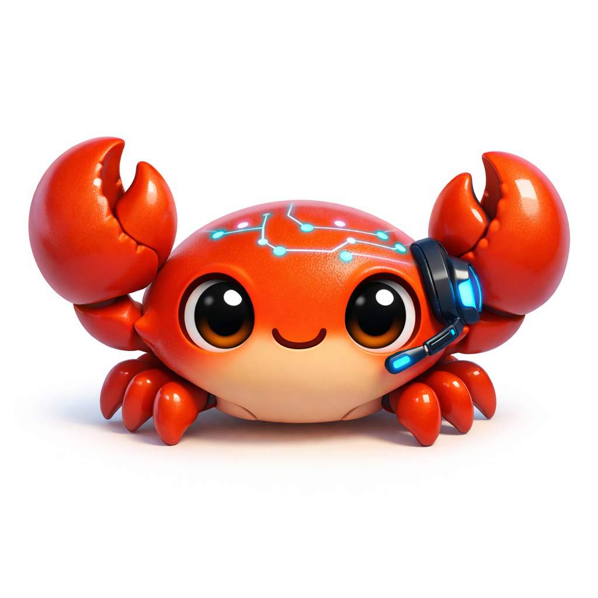

# Cute CrabBot AI Agent v6.1 🦀✨



## 🌟 "صغير ولكنه جبار"
**Cute CrabBot** هو وكيل ذكاء اصطناعي سيبراني يجمع بين المظهر اللطيف والقوة التقنية الهائلة. مستوحى من أفضل أنظمة الـ AI مثل **MoltBot** و **CloudBot**، يأتي CrabBot بهوية جديدة تجعل اختبارات الأمن السيبراني تجربة ممتعة واحترافية في آن واحد.

## 🦀 الميزات الجديدة (Cute & Powerful)
*   **Friendly Swarm:** نظام وكلاء متعددين يعملون بانسجام تام (Scout, Infiltrator, Analyst, Auditor).
*   **Kawaii Interface:** واجهة مستخدم جديدة في الترمينال تتميز بفن ASCII لطيف ورسائل ودودة.
*   **Smart Pinch (File Intelligence):** قدرة ذكية على فحص ملفات الكود واكتشاف الثغرات بلمسة واحدة.
*   **Turbo Speed:** لا تدع المظهر اللطيف يخدعك، فالمحرك لا يزال خارق القوة ويحاكي 30,000 بوت.

## 🛠 التثبيت السريع
```bash
npm install -g crab-bot
```

## 📖 كيفية الاستخدام
ببساطة، اطلب من صديقك الكراب البدء:
```bash
crab-bot
```

## ⚠️ تذكير ودي
صديقنا الكراب يحب المساعدة، لذا يرجى استخدامه فقط في الأغراض القانونية والمصرح بها. دعونا نجعل الإنترنت مكاناً أفضل وأكثر أماناً معاً! 💖

## 📜 الترخيص
MIT License - 2026 Cute CrabBot AI Team.
