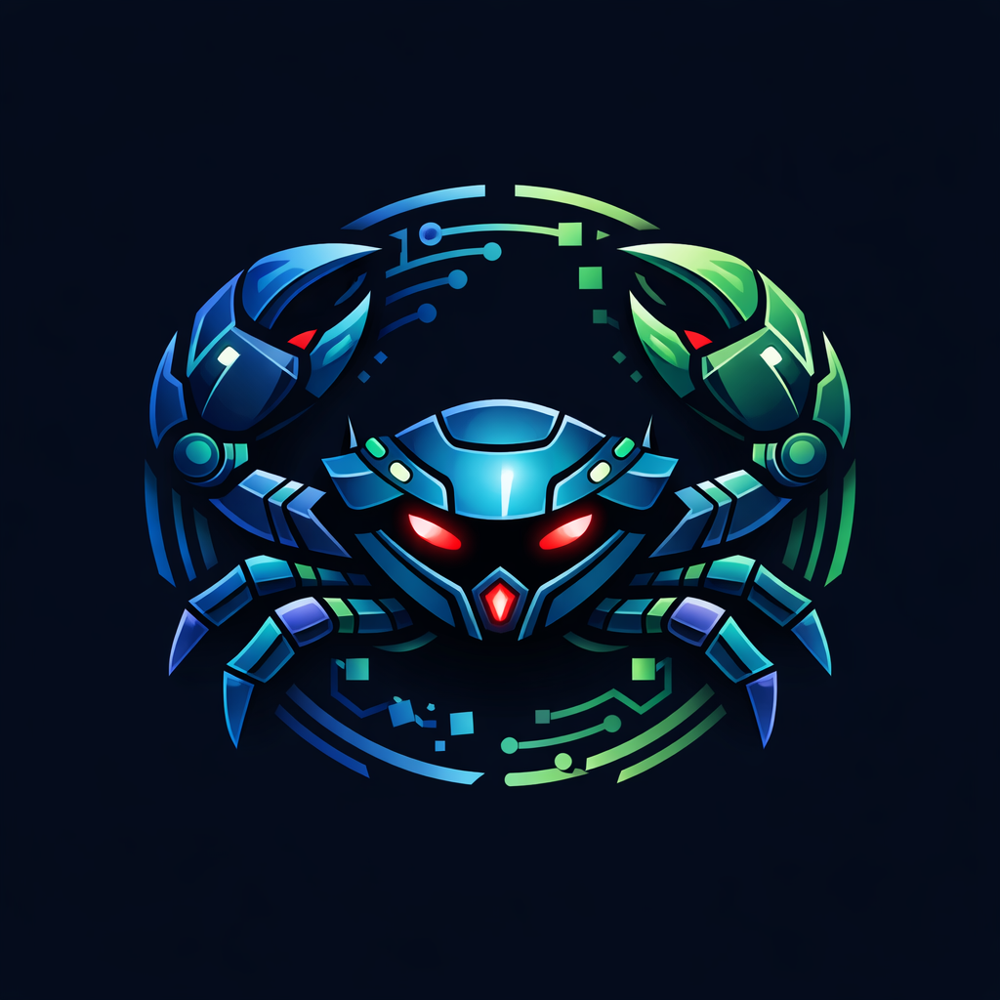

# CrabBot AI Agent v6.0 - The Ultimate Swarm 🦀🤖



## 🚀 ما هو CrabBot AI Agent؟
**CrabBot v6.0** هو الجيل القادم من وكلاء الأمن السيبراني. مستوحى من أنظمة الذكاء الاصطناعي الحديثة مثل **MoltBot** و **CloudBot**، يتجاوز CrabBot كونه مجرد أداة هجوم ليصبح "وكيل ذكاء اصطناعي" (AI Agent) قادر على إدارة عمليات أمنية معقدة بشكل مستقل.

## 🌟 الميزات الثورية (Agent Swarm)
*   **Multi-Agent Swarm:** يستخدم نظام "السرب" حيث يتم توزيع المهام على 4 وكلاء متخصصين (Scout, Infiltrator, Analyst, Auditor).
*   **File Intelligence (CloudBot Style):** القدرة على قراءة وتحليل ملفات المشروع محلياً لاكتشاف الثغرات الأمنية (مثل كلمات المرور المسربة أو الأكواد الخطرة).
*   **Autonomous Decision Making:** الوكيل يتخذ قراراته بناءً على استجابة الخادم، ويقوم بتعديل كثافة الهجوم تلقائياً.
*   **Turbo Swarm Engine:** محرك هجمات فائق السرعة يحاكي 30,000 بوت عبر نظام الوكلاء الموزعين.

## 🛠 التثبيت السريع
```bash
npm install -g crab-bot
```

## 📖 كيفية الاستخدام (Mission Control)
قم بتشغيل الوكيل وابدأ مهمتك:
```bash
crab-bot
```

### أوضاع التشغيل:
1.  **Autonomous Swarm Attack:** هجوم شامل ومنسق بواسطة وكلاء التسلل.
2.  **AI File Intelligence:** فحص الملفات المحلية واكتشاف الثغرات (مثل CloudBot).
3.  **Full Security Audit:** عملية فحص شاملة تجمع بين تحليل الملفات واختبار الضغط.

## 📊 لوحة التحكم الذكية
يعرض الوكيل تقارير حية من كل وكيل نشط في السرب، مما يوفر رؤية كاملة لعملية الاختبار الأمني.

## ⚠️ إخلاء مسؤولية
هذا الوكيل مصمم للأغراض التعليمية والأمنية فقط. استخدامه ضد أهداف غير مصرح بها يعتبر عملاً غير قانوني.

## 📜 الترخيص
MIT License - 2026 CrabBot AI Team.
